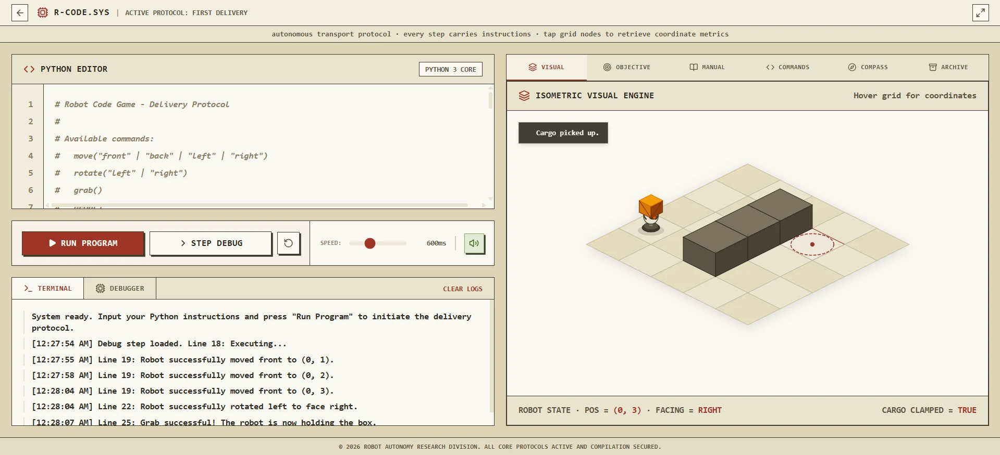
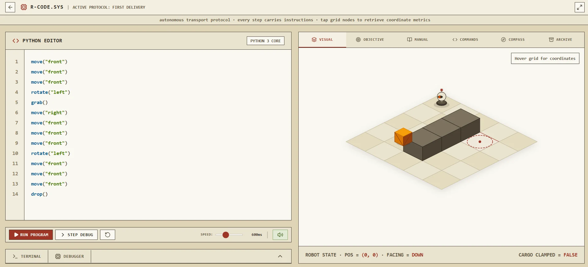

# Robot Code Game

<video src="assets/output.mp4" width="100%" controls autoplay muted loop></video>

Robot Code Game is a retro, vintage-terminal themed browser game designed to teach real Python programming by instructing a logistics robot drone (**Unit R-07**) to navigate isometric grids, retrieve cargo, and optimize execution metrics.

  
  

## 🚀 Key Design Pillars

1. **Pedagogical Progression**: The progression mimics standard Python instruction. The player learns commands in order: console printing → basic sequencing → relative movement directions → in-place rotations → cargo manipulation → sensory queries → conditional branches (`if`/`else`).
2. **Data-Driven Architecture**: Puzzles are purely structured configurations, not hardcoded scenes. New maps and rules can be introduced just by adding new `.ts` or `.json` puzzle definitions.
3. **Interpreter Call Registry**: Commands are not hardcoded inside the Virtual Machine (VM). The interpreter relies on a dynamically built registry that exposes or locks commands based on the player's advancement.
4. **Metric Optimization**: Completing a puzzle is only the first step. The system archives multiple player solutions and tracks metrics like instruction count, non-comment lines of code, and steps-to-solve, comparing results against target par metrics.
5. **Decluttered HUD Viewport**: The layout is locked to a fixed window to avoid browser scrollbar clutter. Scaffolding panels are consolidated into a tabbed inspector container, and the puzzle objective collapses into a compact recall bar.

---

## 🛠 Core System Architecture

### 1. Compilation & Simulation Pipeline
* **Python Parser & VM** ([robotInterpreter.ts](file:///d:/programing/JavaScript/React/robot-code-game/src/robotInterpreter.ts)): Compiles user-written code into an Abstract Syntax Tree (AST) and evaluates it synchronously against a cloned copy of the initial world grid. It produces a `VMAction` queue.
* **Simulation Loop Hook** ([useRobotSimulation.ts](file:///d:/programing/JavaScript/React/robot-code-game/src/hooks/useRobotSimulation.ts)): Consumes the `VMAction` queue to play back grid changes step-by-step using configurable speeds, and manages line-level highlighting in the code editor during runtime.
* **Syntax Tokenizer & Editor** ([CodeEditor.tsx](file:///d:/programing/JavaScript/React/robot-code-game/src/components/CodeEditor.tsx)): A layered text-editor UI rendering custom regex-based syntax tokenization on top of a code input grid, synced with line-level debugging markers.

### 2. Dialogue & Narrative System
* **Onboarding & Lessons** ([DialoguePopup.tsx](file:///d:/programing/JavaScript/React/robot-code-game/src/components/DialoguePopup.tsx) & [scripts.ts](file:///d:/programing/JavaScript/React/robot-code-game/src/dialogue/scripts.ts)): Implements a visual popup transmission mode where Unit R-07 interacts with the operator via distinct emotional expressions.
* **Game-Event Triggers** ([triggers.ts](file:///d:/programing/JavaScript/React/robot-code-game/src/dialogue/triggers.ts)): Map scripts to specific events such as puzzle loading, first command usage, or successful completion.
* **Ambient Mood Avatar** ([InspectorPanel.tsx](file:///d:/programing/JavaScript/React/robot-code-game/src/components/InspectorPanel.tsx)): A compact avatar displayed inside the inspector header mapping Unit R-07's ambient expression (`idle`, `talking`, `happy`, `excited`, `confused`, `sad`) to simulation conditions in real-time.

### 3. Progression & Persistence
* **Research Tree** ([ResearchTree.tsx](file:///d:/programing/JavaScript/React/robot-code-game/src/components/ResearchTree.tsx) & [tree.ts](file:///d:/programing/JavaScript/React/robot-code-game/src/progression/tree.ts)): Provides a visual nodal schematic representing Python capabilities. Nodes provide technical API manuals alongside lesson recaps of what the robot previously taught.
* **Unlocks & State Persistence** ([saveData.ts](file:///d:/programing/JavaScript/React/robot-code-game/src/state/saveData.ts)): Local storage utility tracking solved puzzle identifiers, unlocked research nodes, active registry command sets, and the multiple code solution archives.
* **Trophies & Badges** ([AchievementsPanel.tsx](file:///d:/programing/JavaScript/React/robot-code-game/src/components/AchievementsPanel.tsx) & [achievements.ts](file:///d:/programing/JavaScript/React/robot-code-game/src/progression/achievements.ts)): Automatically awards visual achievements for milestones like minimalist code golf (under 6 lines), instruction optimization (under 15 instructions), or utilizing specific control flow statements.

### 4. User Interface & Controls
* **Tabbed Inspector panel** ([InspectorPanel.tsx](file:///d:/programing/JavaScript/React/robot-code-game/src/components/InspectorPanel.tsx)): Groups Manual instructions, command documentation, the absolute coordinate grid Compass ([OrientationCompass.tsx](file:///d:/programing/JavaScript/React/robot-code-game/src/components/OrientationCompass.tsx)), and saved solution logs into a single responsive space.
* **Visual Engine** ([IsometricVisualEngine.tsx](file:///d:/programing/JavaScript/React/robot-code-game/src/components/IsometricVisualEngine.tsx)): Projects 2D grid coordinates onto an SVG screen with custom extruded polygons representing obstacles, crates, and the robot. Handles depth-based z-sorting.
* **Fixed Game Shell** ([App.tsx](file:///d:/programing/JavaScript/React/robot-code-game/src/App.tsx) & [Header.tsx](file:///d:/programing/JavaScript/React/robot-code-game/src/components/Header.tsx)): Locks screen size, styles scrolling bars with a terminal feel, and provides a fullscreen API switch.
* **Sandbox Playground** ([PlaygroundPanel.tsx](file:///d:/programing/JavaScript/React/robot-code-game/src/components/PlaygroundPanel.tsx)): Accessible via `Ctrl+Shift+D`, `Ctrl+Alt+P`, or by appending `?dev=1` to the URL. Allows creators to select custom maps, hot-reload puzzle configurations, inspect raw state, and run an automated layout linter.

---

## 🎓 The Onboarding Curriculum

The game features an ordered progression track:

| ID | Title | Concept Taught | Unlocks |
| :--- | :--- | :--- | :--- |
| `000-say-hello` | **Say Hello** | Diagnostics printing via `print()` | `move()` forward capability |
| `001-first-steps` | **First Steps** | Sequence order & forward translation | Relative directions: `left`, `right`, `back` |
| `002-around-the-wall` | **Around the Wall** | Evading barriers using relative movements | In-place rotation command `rotate()` |
| `003-pickup-and-delivery` | **Pickup and Delivery** | Interacting with grid items | Cargo commands `grab()` & `drop()` |
| `004-first-delivery` | **First Delivery** | Multi-concept choreography | Sensor commands `is_holding()` & `can_move()` |
| `005-around-the-bend` | **Around the Bend** | Reactive loops & branching | Conditional structure `if`/`else` |

---

## ⚙️ Development & Build Tasks

To launch and maintain the application local environment:

* `pnpm dev` — Start Vite developer server on [http://localhost:3000](http://localhost:3000).
* `pnpm build` — Compile production bundle inside the `dist/` directory.
* `pnpm preview` — Run a preview server on compiled resources.
* `pnpm lint` — Execute typescript type safety verification (`tsc --noEmit`).
* `pnpm clean` — Remove temporary cache build structures.
